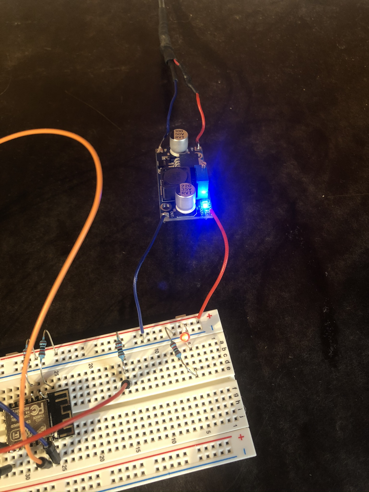
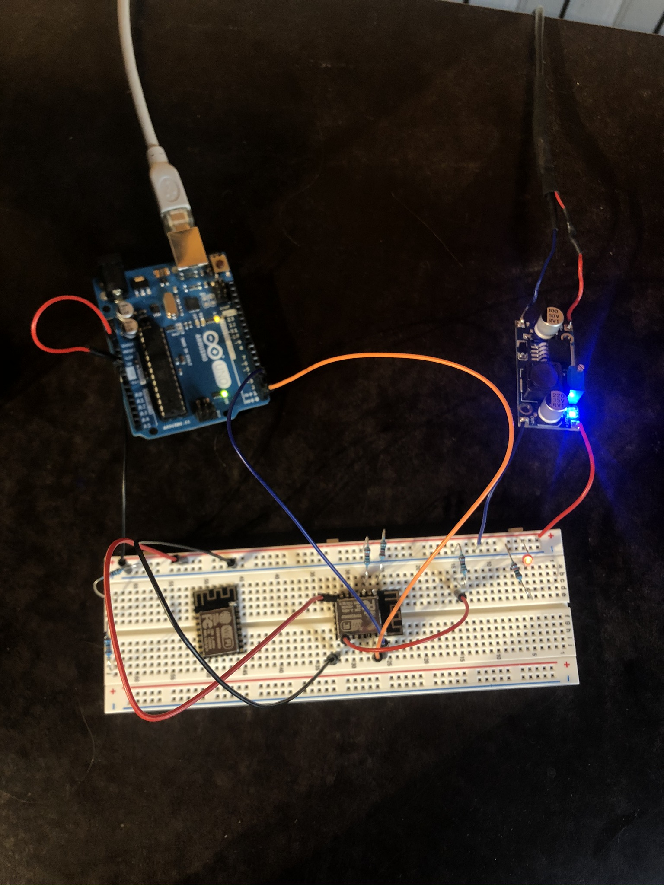

# Electronic work presentation 

This document is a presentation that I keep for myself to remember what I have done, that shows all the electronic work done for the CHIC project. It is some sort of personal documentation, that I try to let clean to illustrate the progress that i am doing. In contains the following sections : 
1. Setting up ESP8266 with an arduino
1.1. Home made voltage source
1.2. Home made USB to TTL cabe (to command the module using arduino's UART from my computer)
1.3. Setting up server in R-PI for UDP communication
2. Processing usage within R-PI for image generation

# Wifi module with Arduino and R-PI

The ESP8266 wifi module is a MC that is able to connnect to wifi and to be a wifi routeur. The one that I bought has to be flashed to have some code, and it already has **AT command library**. firmware[a] is a specific class of computer software that provides the low-level control for a device's specific hardware.

We use AT commands to do the most basic operations (setting wifi mode, decide how to )
Wifi module used: ESP-8266-12F

## Problem 1: Current supply of the ESP8266

The second problem is for the current. The wifi module needs that have at maximum 500 mA, and the 5V output pin is good for 400 mA, so I am not sure it will work fine. The 3.3V output is capable of supplying 150 mA. The voltage input of the wifi module has to be maximum 3.6V.

### Solution for current supply: Step-Down Voltage Converter

I have found in my stuff Dc-Dc converter that I can use. By using a USB cable, i was able to create a voltage source with high current tolerance which can go up to 4.4 Volts (that's enough for my wifi module) and that is controllable. I will let it at 3.5 volts for now !

Here is the set-up that i did for the DC-DC 5v to 3.3v converter.



Now, I need to start working with the wifi module, which is not going to be easy since I can't flash it... Or I don't know how to do so. Let's try some things.

## Problem 2: Flashing the ESP8266-12F

It turned out that the wifi module I am using is not a single wifi module but is a proper MC itself that needs to be flashed. I do not have a cable to flash it, so it will be very difficult to do anything without it. However I will still try to do without one.

Maybe we don't need flashing, according to those 2 tutorial
https://www.instructables.com/id/Add-WiFi-to-Arduino-UNO/
https://www.instructables.com/id/ESP-12E-ESP8266-With-Arduino-Uno-Getting-Connected/

AT Tutorial to connect to internet: https://arduino.stackexchange.com/questions/32567/get-data-from-website-with-esp8266-using-at-commands
And AT commands tutorial: https://www.esp8266.com/viewtopic.php?f=12&t=13556

### Solution to problem 2

So at the end I found proper way to connect to server using the AT example PDF. Properly, I am not flashing the MC but instead I am sending instructions to it.

The list of AT Commands to use are the following

```
AT+CWMODE=3 // Set station mode of the module
AT+CWJPA="name_of_wifi","password" // Connect to the wifi if that wasn't the case
AT+CIFSR // Verify that wifi is connected (this gives the IP address of the ESP8266)
AT+CIPSTART="TCP","192.168.1.37",80 // Connects to the server
AT+SEND=N // Send n bytes
> bytes_to_send
AT+CIPCLOSE // End the connection
```

The setup to use the Arduino board as USB-TTL cable is the following:




## Problem 3: The web server (UDT protocol connection)

My first ID was to use a HTTP server (like Python.flask or python.Django) but I think it's better to use low-level protocol like TCP or UDT

### TCP or UDP ?

According to this link: http://www.skullbox.net/tcpudp.php, UDP is faster than TCP. The main difference is that TCP is a protocol that waits for a confirmation of received data every time a package is sent, as UDP is a streaming protocol that keeps sending data even if some error occured during the transmission of previously sent data. In our case, we will want to have streaming of sensed data and we don't care if some data was not sent correctly. Therefore, we will want to use TCP.


# Processing and Arduino

We want to use the data collected by Arduino to generate some videos on processing

Use processing in python: https://py.processing.org/tutorials/gettingstarted/

Connection between Arduino and processing: https://maker.pro/arduino/tutorial/how-to-make-arduino-and-processing-ide-communicate
